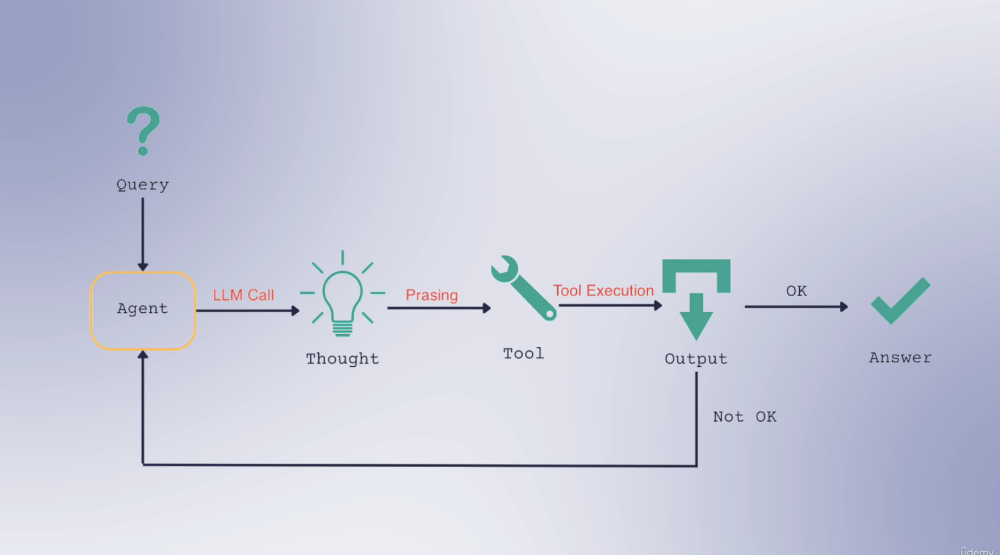

# react-agent-langchain

make a personalized ReAct-agent using LangChain

### Component Input/Output Type

| Component    | Input Type                              | Output Type             |
| ------------ | --------------------------------------- | ----------------------- |
| Prompt       | dict                                    | `PromptValue`           |
| Retriever    | str                                     | list[documents]         |
| LLM          | str, list[`ChatMessage`], `PromptValue` | str                     |
| Chat Model   | str, list[`ChatMessage`], `PromptValue` | `ChatMessage`           |
| Tool         | str, dict[?]                            | \*depends on the tool   |
| OutputParser | output of an LLM or ChatModel           | \*depends on the parser |

### Agent Lifecycle

